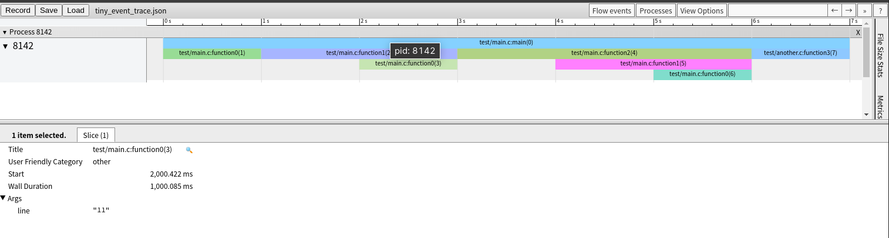

# tiny-event-trace
Profile your C code with [chrome://tracing](chrome://tracing)



## Get started
### Build

```bash
$ mkdir -p build
$ cd build
$ cmake ..
$ make
```

### Install

```bash
$ make install
```

### Uninstall

```bash
$ cat install_manifest.txt | xargs rm
```

### Trace event

Have a look at `test/main.c` first.

```bash
$ gcc -L/usr/local/lib/tiny_event_trace -ltiny_event_trace test/another.c test/main.c -o test.out
$ ./test.out
```

Open [chrome://tracing](chrome://tracing) and upload the JSON file.

Another example:

```c
/* main.c */
#include <tiny_event_trace/tiny_event_trace.h>   /* Public APIs */
#include <tiny_event_trace/global_event_list.h>  /* Global event list and event ID*/

void your_function(void)
{
    tet_event_id_t id = tet_global_event_id++;
    tet_trace_begin_default(id);

    sleep(10);

    tet_trace_end_default(id);
}

int main(void)
{
    /* Initialize */
    tet_global_event_list = tet_init_event_list(0);
    tet_global_event_id = 0;

    /* Serialize */
    tet_serialize_event_list(tet_global_event_list);

    /* Trace Begin */
    tet_event_id_t id = tet_global_event_id++;
    tet_trace_begin_default(id);

    /* Your workload here */
    your_function();

    /* Trace End */
    tet_trace_end_default(id);

    /* Clean up */
    tet_destroy_event_list(tet_global_event_list);

    return 0;
}
```
